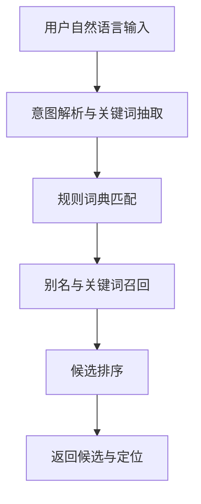
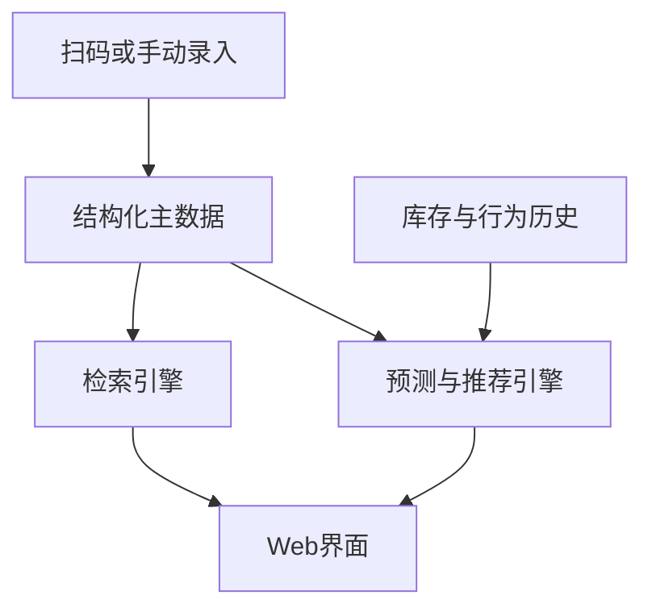

# AI元器件分拣箱 - AI辅助决策与自然语言检索方案

## 一、功能目标

本文档用于定义 AI 元器件分拣箱下一阶段的核心能力方向，使系统从“按编号查找 + LED 定位”升级为“可理解需求、可辅助决策、可提前预警”的智能元器件管理系统。

目标能力包括：

| 能力方向 | 目标描述 | 示例 |
|------|------|------|
| 自然语言检索 | 用户不必记住料号，可直接按用途、参数、类别检索元器件 | “帮我找 10k 电阻” |
| 库存预测 | 根据历史出入库与使用频率，预测未来库存变化趋势 | “下周 10uF 电容是否会缺货” |
| 补货提醒 | 当库存接近阈值或预计将低于安全库存时提前提醒 | “AMS1117 预计 5 天内低于安全库存” |
| 相似元件推荐 | 在缺货、替换或设计选型时推荐相近器件 | “0603 10k 电阻没货时推荐可替代器件” |

这些能力比单纯的扫码录入和编号定位更能体现“AI 元器件分拣箱”的 AI 属性，因为系统开始理解“用户想找什么”“库存会发生什么”“缺货时可以用什么替代”。

---

## 二、为什么这才是“AI”

当前系统已经具备“扫码录入、编号查找、LED 定位、喇叭提示”等实用能力，但本质上仍然是规则驱动的物料映射系统：

1. 用户输入的是明确编号，系统做的是精确匹配。
2. 扫码录入本质上是二维码解码和字段提取。
3. LED 分配本质上是逻辑槽位映射和固定规则计算。
4. 当前系统不会理解“10k 电阻”“可替代的稳压器”“快用完的常用器件”这类语义需求。

因此，未来版本需要补上一层“面向语义的检索”和“面向决策的建议”能力。

从产品定义上看，可以将系统能力分成三层：

| 层级 | 当前状态 | 未来目标 |
|------|------|------|
| 数据层 | 保存料号、槽位、颜色 | 保存主数据、库存数据、行为数据、推荐特征 |
| 检索层 | 按 `part_number` 精确检索 | 按类别、参数、用途、别名、自然语言检索 |
| 决策层 | 无预测、无建议 | 提供库存预测、补货提醒、相似器件推荐 |

---

## 三、当前系统基础

### 3.1 已具备的能力

当前项目已经具备以下基础，可作为后续 AI 能力的底座：

| 基础能力 | 现状说明 |
|------|------|
| 扫码录入 | 支持实时扫码、拍照识别、手动输入 |
| 编号标准化 | 可从二维码内容中提取 `pc`、`part_number`、`part-number`、`pn` |
| 精确查找 | 可按 `part_number` 查找元器件 |
| 物理定位 | 根据逻辑槽位映射到 LED 索引与组号 |
| 数据持久化 | 元器件数据可保存在 `SPIFFS` 中 |
| Web API | 已有增删改查、备份、恢复、状态查询接口 |
| 实时反馈 | 已有 WebSocket 广播框架，可用于状态同步与提醒 |

### 3.2 当前主流程

```text
扫码 / 手动输入 / 拍照识别
    -> 提取 part_number
    -> 调用 /api/components/add
    -> 服务端校验是否重复
    -> 分配逻辑槽位、实际 LED、组号、颜色
    -> 保存到本地数据库
    -> 返回定位结果并闪烁提示
```

### 3.3 当前数据结构的局限

目前元器件记录仍是“编号到槽位”的轻量映射，核心字段只有：

| 字段 | 说明 |
|------|------|
| `part_number` | 元器件编号 |
| `led_index` | 逻辑 LED 槽位 |
| `r/g/b` | 显示颜色 |

这说明系统目前更适合做“精确定位”，还不适合做“语义理解”和“库存决策”。

---

## 四、当前数据缺口

要实现自然语言检索、库存预测、补货提醒和相似推荐，必须补足数据层。当前主要缺口如下。

### 4.1 主数据缺口

| 缺失字段 | 用途 |
|------|------|
| `name` | 人类可读名称，如“贴片电阻 10k 1%” |
| `category` | 分类，如电阻、电容、芯片、连接器 |
| `package` | 封装，如 0402、0603、SOT-223 |
| `spec` | 规格摘要，如 10k、10uF、3.3V |
| `brand` | 品牌或厂商 |
| `description` | 功能说明 |
| `keywords` | 检索关键词 |
| `aliases` | 别名、简称、口语叫法 |
| `datasheet_url` | 数据手册地址 |
| `supplier_code` | 供应商物料编码 |

### 4.2 库存数据缺口

| 缺失字段 | 用途 |
|------|------|
| `quantity` | 当前库存数量 |
| `unit` | 单位，如 pcs、袋、盘 |
| `safe_stock` | 安全库存 |
| `min_stock` | 最小库存阈值 |
| `lead_time_days` | 采购周期 |
| `last_restock_at` | 最近补货时间 |
| `last_used_at` | 最近领用时间 |
| `avg_daily_usage` | 平均日消耗量 |

### 4.3 行为数据缺口

| 缺失字段 | 用途 |
|------|------|
| `search_count` | 检索热度分析 |
| `pick_count` | 实际取用频率 |
| `use_history` | 消耗与出入库时间序列 |
| `search_history` | 用户需求趋势分析 |
| `co_occurrence` | 共用器件关系，用于推荐 |

### 4.4 推荐特征缺口

| 缺失字段 | 用途 |
|------|------|
| `replacement_group` | 可替代分组 |
| `compatible_specs` | 可兼容规格 |
| `similarity_tags` | 相似特征标签 |
| `application_tags` | 应用场景标签 |

---

## 五、自然语言检索方案

### 5.1 功能定义

自然语言检索是指用户不再必须输入准确料号，而是可以用接近日常表达的方式提出需求，系统理解后返回候选元器件并定位。

示例：

| 用户表达 | 系统目标输出 |
|------|------|
| “帮我找 10k 电阻” | 返回 10k 电阻列表，并优先定位库存最多或最近常用器件 |
| “给我一个 3.3V 稳压芯片” | 返回 LDO/稳压器类器件 |
| “有没有 0603 的红色 LED” | 按分类 + 封装 + 颜色联合筛选 |
| “找一下常用的单片机下载接口” | 按名称、别名、用途标签检索 |

### 5.2 推荐实现思路

第一阶段不必直接接入大模型，可采用“规则检索优先，语义检索增强”的方案：

1. 先把用户输入分解为类别词、参数词、封装词、用途词。
2. 用规则词典匹配结构化字段。
3. 用关键字和别名做模糊召回。
4. 再用评分机制做排序。
5. 条件不足时再引入 LLM 做语义补全或改写。

### 5.3 检索排序建议

可采用如下排序因子：

| 排序因子 | 说明 |
|------|------|
| 精确规格匹配 | 数值、封装、类别完全匹配优先 |
| 库存数量 | 库存充足优先 |
| 最近使用频率 | 常用器件优先 |
| 用户最近选择 | 提高连续操作效率 |
| 替代风险 | 原始器件优先于替代器件 |

### 5.4 降级策略

当语义理解失败时，系统应逐级降级：

1. 返回关键词匹配结果。
2. 提示用户补充参数，例如封装、电压、功率。
3. 允许用户从候选列表手动确认。
4. 若仍无结果，则退回 `part_number` 精确检索模式。

### 5.5 交互流程



---

## 六、库存预测与补货提醒方案

### 6.1 功能定义

库存预测是指系统基于历史消耗、补货记录和采购周期，预测未来一段时间的库存变化。补货提醒则是在预测结果或当前库存达到阈值时，自动触发提醒。

### 6.2 能力目标

| 能力 | 输出示例 |
|------|------|
| 当前库存风险判断 | “该元件库存已低于安全库存” |
| 短期缺货预测 | “预计 7 天后库存归零” |
| 补货优先级排序 | “本周建议优先补货 5 类常用器件” |
| 周期型需求识别 | “该器件在每周二与周五使用量较高” |

### 6.3 第一阶段建议

在没有复杂 AI 模型的前提下，先落地规则型预测：

| 方法 | 说明 |
|------|------|
| 阈值提醒 | 当 `quantity <= safe_stock` 时提醒 |
| 均值预测 | 用近 7 天或近 30 天平均消耗估算可用天数 |
| 采购周期判断 | 若 `预计可用天数 < lead_time_days`，则建议补货 |
| 热门器件优先 | 对高使用频次器件提高提醒等级 |

公式示例：

```text
预计可用天数 = 当前库存 quantity / 平均日消耗 avg_daily_usage

若 预计可用天数 <= lead_time_days
则触发补货提醒
```

### 6.4 后续 AI 增强方向

当积累足够时间序列数据后，可增加以下能力：

1. 使用滑动窗口预测未来库存变化。
2. 识别项目阶段带来的周期性领用变化。
3. 结合历史工程记录识别“某类项目启动后哪些器件会同步消耗”。
4. 对误报率高的提醒进行自适应校准。

### 6.5 补货提醒分级

| 等级 | 条件 | 动作 |
|------|------|------|
| 正常 | `quantity > safe_stock` | 无提醒 |
| 关注 | 接近安全库存 | 页面显示黄色提示 |
| 预警 | 预计在采购周期内耗尽 | 页面和消息推送提醒 |
| 紧急 | 已低于最小库存或已缺货 | 高优先级提醒，建议替代器件 |

---

## 七、相似元件推荐方案

### 7.1 功能定义

相似元件推荐用于解决以下问题：

1. 原器件缺货时，系统推荐可替代器件。
2. 用户不确定具体型号时，系统提供同类候选。
3. 在设计选型或备料时，系统推荐同规格常用器件。

### 7.2 推荐类型

| 推荐类型 | 说明 | 示例 |
|------|------|------|
| 同规格推荐 | 参数基本一致 | 10k 0603 1% 电阻的同规格器件 |
| 同封装推荐 | 封装一致，参数接近 | SOT-223 稳压器候选 |
| 可替代推荐 | 功能兼容，可替换 | 同电压同电流 LDO |
| 常用搭配推荐 | 经常一起使用 | 单片机旁路电容、下载接口 |

### 7.3 推荐规则建议

在项目初期可使用规则推荐：

| 优先级 | 推荐规则 |
|------|------|
| P1 | 分类一致 |
| P2 | 关键规格一致 |
| P3 | 封装一致或兼容 |
| P4 | 库存充足 |
| P5 | 使用频率较高 |

### 7.4 后续 AI 增强方向

后续可逐步升级为：

1. 基于标签和规格的相似度计算。
2. 基于使用历史的协同推荐。
3. 基于项目上下文的场景推荐。
4. 基于工程 BOM 的替代链推荐。

### 7.5 风险控制

对于“相似推荐”和“可替代推荐”必须区分：

| 类型 | 风险 |
|------|------|
| 相似推荐 | 仅表示“看起来相近”，不保证可直接替换 |
| 可替代推荐 | 需要满足明确兼容规则，建议单独标记 |

因此系统界面应明确显示：

1. “相似”不等于“可替代”。
2. 推荐结果必须展示关键参数差异。
3. 关键电气参数不满足时不得标为“可替代”。

---

## 八、分阶段落地路线

### 8.1 第一阶段：补齐业务字段，建立结构化主数据

目标：

1. 扩展元器件数据模型。
2. 在录入页面支持填写或补录名称、分类、封装、规格、数量等字段。
3. 让系统先支持基于字段的条件检索。

输出成果：

| 项目 | 说明 |
|------|------|
| 数据模型升级 | 从“编号映射表”升级为“元器件主数据表” |
| 录入流程升级 | 支持扫码后补充结构化字段 |
| 基础检索升级 | 支持类别、规格、封装筛选 |

### 8.2 第二阶段：增加库存管理与提醒

目标：

1. 增加数量、安全库存、出入库记录、采购周期等字段。
2. 建立补货提醒规则。
3. 在 Web 页面提供低库存看板。

输出成果：

| 项目 | 说明 |
|------|------|
| 出入库记录 | 支持领用、归还、补货 |
| 规则提醒 | 支持低库存和采购周期预警 |
| 风险看板 | 支持查看高风险器件列表 |

### 8.3 第三阶段：引入自然语言检索

目标：

1. 支持按自然语言查询元器件。
2. 增加别名、关键词、用途标签。
3. 增加排序策略和候选确认机制。

输出成果：

| 项目 | 说明 |
|------|------|
| 检索输入升级 | 从 `part_number` 输入框扩展为自然语言查询框 |
| 检索召回升级 | 规则词典 + 模糊匹配 + 语义增强 |
| 用户体验升级 | 输入“10k 电阻”即可定位候选元件 |

### 8.4 第四阶段：引入预测与推荐

目标：

1. 基于时间序列做库存趋势预测。
2. 基于规格、标签和历史行为做相似推荐。
3. 在缺货或低库存时给出替代建议。

输出成果：

| 项目 | 说明 |
|------|------|
| 库存预测 | 提前识别风险物料 |
| 补货建议 | 生成建议补货清单 |
| 相似推荐 | 为查找与缺货场景提供替代选项 |

---

## 九、接口与数据模型建议

### 9.1 建议新增字段

建议将元器件模型从当前结构扩展为：

```json
{
  "part_number": "C2930027",
  "name": "贴片电阻 10k 1%",
  "category": "resistor",
  "package": "0603",
  "spec": "10k 1% 1/10W",
  "brand": "Yageo",
  "quantity": 320,
  "unit": "pcs",
  "safe_stock": 100,
  "min_stock": 50,
  "lead_time_days": 7,
  "keywords": ["10k", "电阻", "0603"],
  "aliases": ["10K电阻", "R10K"],
  "application_tags": ["分压", "上拉", "限流"],
  "replacement_group": "resistor_10k_0603_1pct",
  "led_index": 5,
  "group": 1,
  "r": 120,
  "g": 200,
  "b": 80
}
```

### 9.2 建议新增接口

| 接口 | 方法 | 说明 |
|------|------|------|
| `/api/search/natural` | POST | 自然语言检索 |
| `/api/components/stock/update` | POST | 出入库更新 |
| `/api/components/alerts` | GET | 获取低库存与补货提醒 |
| `/api/components/recommend` | POST | 获取相似元件或替代推荐 |
| `/api/components/history` | GET | 获取单个器件历史记录 |

### 9.3 建议的数据流



---

## 十、与现有系统的对应关系

| 现有文件 | 当前作用 | 后续扩展方向 |
|------|------|------|
| `main/iot/component_database.h` | 元器件数据模型定义 | 扩展结构化主数据与库存字段 |
| `main/iot/component_database.cc` | 存储、导入、导出、查找 | 增加库存记录、历史记录、推荐特征存储 |
| `main/iot/component_sorter.cc` | 查找、录入、逻辑槽位分配 | 增加自然语言检索和推荐接口逻辑 |
| `main/iot/component_http_server.cc` | Web 页面与 HTTP API | 增加自然语言查询、补货看板、推荐面板 |
| `docs/scan_entry方案.md` | 扫码录入方案 | 与 AI 检索和库存决策能力形成配套文档 |

---

## 十一、版本信息

| 版本 | 日期 | 说明 |
|------|------|------|
| v1.0 | 2026-03-12 | 首次提出 AI 辅助决策与自然语言检索方案，明确自然语言检索、库存预测、补货提醒、相似推荐四大方向 |

---

如需进一步落地，可继续拆分为以下专题文档：

1. 自然语言检索接口设计文档
2. 元器件主数据模型升级文档
3. 库存记录与补货提醒规则文档
4. 相似元件推荐规则与风险控制文档
